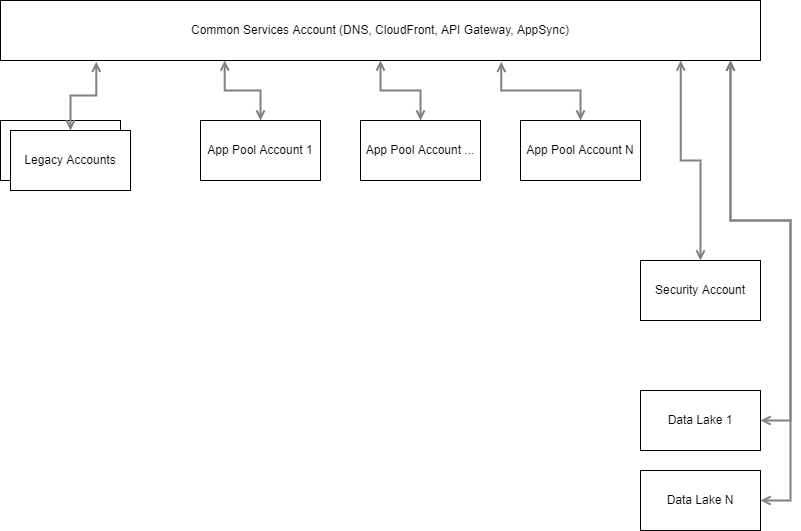

# AWS Account Structure

Per the recommendations provided from the AWS Well Architected review:

"We strongly recommend segregating the Master account functionalities and creating the security-audit/log-archive and the shared-services AWS accounts in line with the AWS CIS Foundations Benchmark and the well-architected framework."

The diagram below outlines the approach that we plan on utilizing as well as the data flow between accounts that will be implemented by Opti9 using their Small Jumpstart program.

**Note:** While the "Master account" is not present in the diagram it is in scope and will be created.  As it's function is to manage the other accounts and provide billing rollup it does not impact functionalities.  Thus it has been left out of this view.

