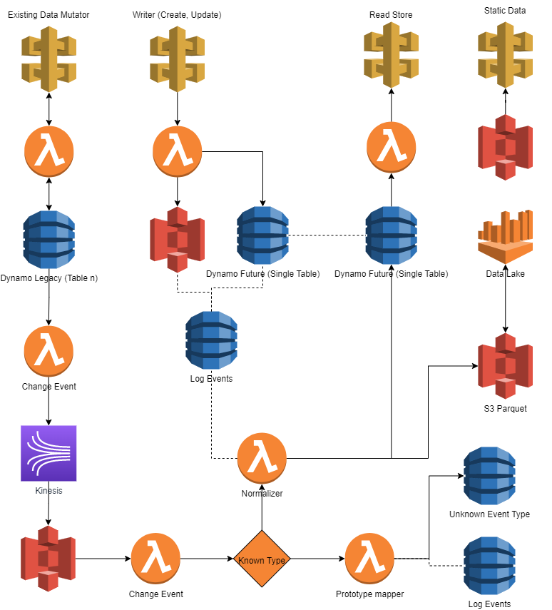

# Business Intelligence

Business intelligence (BI) combines business analytics, data mining, data visualization, data tools and infrastructure, and best practices to help organizations to make more data-driven decisions. In practice, you know you’ve got modern business intelligence when you have a comprehensive view of your organization’s data and use that data to drive change, eliminate inefficiencies, and quickly adapt to market or supply changes.

# Data Storage - AWS Athena

Amazon Athena is an interactive query service that makes it easy to analyze data in Amazon S3 using standard SQL. Athena is serverless, so there is no infrastructure to manage, and you pay only for the queries that you run.

While there are other solutions out there Athena provides us all our needs without having to manage infrastructure.  For this reason alone we will be using it to build out the data lake that will be used to provide data to the BI Tool of choice.

## Data Transformation

Data is currently stored across multiple tables that are joined together using relational identities.  The mutation of these tables emits events that we can capture and use to create our own denormalized and standardized event stream that we will use to create the flat structure needed for the BI tools.

Initially all data will end up in the unknown table in DynamoDB, this data will be analyzed, denormalized and added to the parquet format, then the records will be dumped to S3 where Athena can then operate over the top of them allowing the BI tool to query and visualize the available data.

# BI Tools

There are really two industry leaders that integrate seamlessly with AWS Athena.  Those are Tableau and Looker.

## Option 1 - Tableau

Tableau is a powerful BI tool used for data visualization. Data analysis can be done quickly and effectively using Tableau. Visualizations of data can be created in the form of dashboards, graphs, and worksheets. Tableau has ready-made templates; so you can easily prepare dashboards with drag and drop features. It allows the user to create visuals and graphics without the help of any programmer. Any professional can understand the data that is created using Tableau.

## Option 2 - Looker

Looker is a BI tool used for data visualization. Looker helps in creating and configuring the charts and graphs with the drop and drag function. You can also put your desired elements and assign roles such as Users, Developers, and Administrators so that the visualization of the data looks efficient. Using mapping, feature non-technical users can also prepare highly technical data visualizations.
