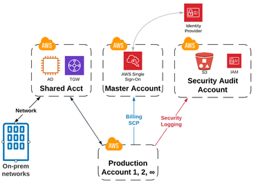
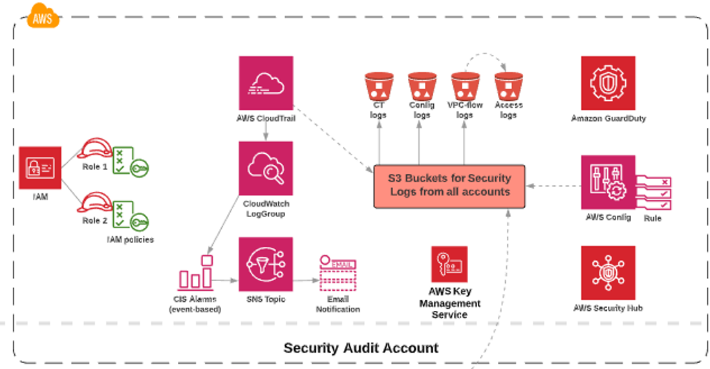

# Security

## Account Structure

## Recommendations

 * The policies used should be set to the least privilege and reviewed regularly.
 * Create and apply custom SCP policies
   * Isolate region(s)
   * Security controls-
     * Prevents Security CloudTrail modification
     * Prevents S3 Security bucket deletion and modification
     * Prevents GuardDuty removal
     * Prevents VPC Flow log Removal
 * Configure AWS Security Hub to continuously measure the CIS AWS Foundations Benchmark and AWS Best practices.
 * Use AWS Security Hub to aggregate logs into a SEIM if needed.
 * Enable Amazon GuardDuty and aggregate the GuardDuty alerts across multiple accounts.
 * Define controls for network protection to meet your organizational, legal, and compliance requirements.
 * Evaluate and enable the logging capabilities of the services you are using, such as VPC flow logs, ELB logs, S3 bucket logs, Route53 query logs, RDS logs, etc.  
 * Define requirements that will help you control programmatic or automated access with appropriately defined, limited, and segregated access.
 * Configure AWS SSO and use AWS Secrets Manager to manage credentials, passwords, third-party API keys if needed.
 * Utilize tools such as AWS Config to monitor changes to credentials and current status. This can also be used to monitor access/secret keys age and usage and disable them or notify of rotation needed.
 * Recommended AWS Config rules:
   * CloudTrail encryption enabled
   * S3 bucket public write prohibited
   * Root account MFA enabled
   * Restricted ssh
   * IAM-policy-no-statements-with-admin-access
   * IAM-password-policy
   * CloudTrail CloudWatch logs enabled
   * IAM root access key check
   * CloudTrail enabled
   * Multiregion CloudTrail enabled
   * Centralized guard duty
   * CloudTrail log file validation enabled
   * cmk-backing-key-rotation-enabled
   * VPC FlowLogs enabled
   * Access keys rotated
   * It will inherit several security hub CIS compliance rules
