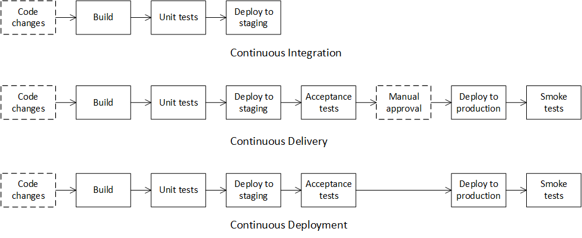

## What is CI/CD?

### Continuous Integration

Continuous Integration is a software development practice in which developers regularly commit and push their local changes back to the shared repository (usually several times a day). By fetching and merging changes from other developers they mitigated the risk of complicated conflict resolution. Before each commit, developers can run unit tests locally on their source code as an additional check before integrating. A _continuous integration_ service automatically builds and runs unit tests on the new source code changes to catch any errors immediately.

>The goal of Continuous Integration is quick integration of changes from individual developers in the team.

### Continuous Delivery

Continuous Delivery is a software development practice that extends Continuous Integration in which source code changes are _automatically prepared_ for deployment to a production instance. After a build, the build artifact with new changes is deployed to a staging instance where advanced (integration, acceptance, load, end-to-end, etc.) tests are run. If needed, the build artifact is automatically deployed to the production instance after _manual_ approval.

>The goal of Continuous Delivery is an automated process to prepare a tested build artifact, ready for automatic deployment to a production instance.

### Continuous Deployment

Continuous Deployment is a software development practice that extends Continuous Delivery in which source code changes are _automatically deployed_ to a production instance. The difference between Continuous Delivery and Continuous Deployment is the presence of manual approval. With Continuous Delivery, deployment to production occurs automatically _after_ manual approval. With Continuous Deployment, deployment to production occurs automatically _without_ manual approval.

>The goal of Continuous Deployment is a short cycle between fully automated applying source code changes from developers and obtaining feedback from customers.
